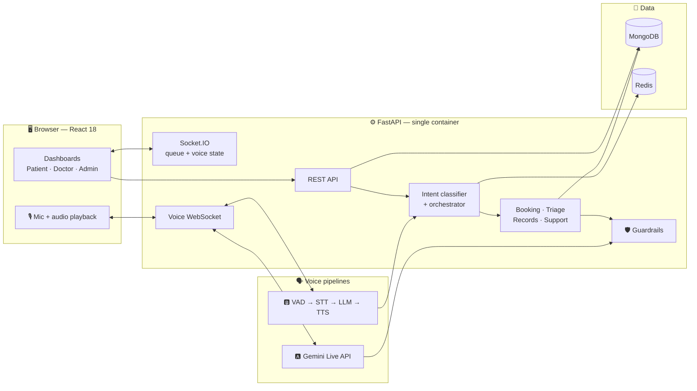

<div align="center">

# 🏥 CareFlow

### Voice-First Patient & Appointment Assistant

*Book appointments, track a live queue, and talk to **CareBot** — a multi-agent voice assistant that speaks English, Hindi and Kannada.*

<br/>


<br/>

[Features](#-features) •
[CareBot](#-carebot--the-voice-agent) •
[Architecture](#-architecture) •
[Latency](#-latency-targets) •
[Guardrails](#-healthcare-guardrails) •
[Quick Start](#-quick-start) •
[Roadmap](#-roadmap)

</div>

---

> [!WARNING]
> **Demo system — do not enter real health information.**
> CareFlow uses synthetic data only. The Gemini free tier allows Google to use submitted content to improve its products, so no real patient data or real voice recordings belong here.

> [!NOTE]
> **Project status:** milestones **M1** and **M2** work end to end apart from containers: login, booking, visit history, the live queue and the doctor's queue controls. Docker Compose and the voice agent are still to come. The design below is the plan from the [PRD](PRD.md); see the [Roadmap](#-roadmap) for what exists today.

## 💡 The Problem

Outpatient departments run on front-desk phone calls and paper tokens. Patients don't know which department to visit, can't see real wait times, and call the front desk for information a system could answer.

**CareFlow** replaces that with real-time queue state, self-service booking, and a voice/text assistant for routine requests — while keeping clinical judgement strictly with doctors.

The engineering focus is the **voice agent**: two interchangeable voice pipelines, measured per-stage latency, graceful failover when free-tier quotas run out, and guardrails enforced in code.

---

## ✨ Features

<table>
<tr>
<td width="33%" valign="top">

### 🧑‍⚕️ Patient

- Book, reschedule and cancel by department or doctor
- Live queue position — *"3 patients ahead of you"*
- Doctor delay broadcasts with updated ETA
- Symptom-based department routing (**not diagnosis**)
- Visit & prescription history (last 12 months)
- Talk to CareBot by voice or text

</td>
<td width="33%" valign="top">

### 👨‍⚕️ Doctor

- Today's queue at a glance
- Mark patients `in_consultation`, `done` or `no_show`
- Broadcast a delay — pushed live to every waiting patient
- Seeded schedules

</td>
<td width="33%" valign="top">

### 📊 Admin

- Department load: queue depth, doctors on duty
- Voice latency P50 / P95 per stage, per pipeline
- Time to first audio
- Intent mix and fallback rate
- Gemini quota errors

</td>
</tr>
</table>

**Languages:** English · हिन्दी · ಕನ್ನಡ · code-mixed speech (*"kal ka appointment cancel karo"*)

---

## 🤖 CareBot — the voice agent

### Four specialist agents

Each agent is bound to a narrow tool set, so it can only do its own job.

| Agent | What it does | Hard limit |
|---|---|---|
| 📅 **Booking** | Checks availability, books, reschedules, cancels — real database tool calls | Acts only for the logged-in patient |
| 🩺 **Triage** | Maps symptoms to a department (*"chest pain" → Cardiology*) | Never diagnoses, prescribes or gives dosage |
| 📋 **Records** | Reads visit and prescription history | The authenticated patient's own records only |
| ℹ️ **Support** | Timings, department locations, emergency contact | — |

**Routing without an LLM call.** A fast local intent classifier (keywords + a small multilingual embedding model) handles most turns on CPU. Only low-confidence turns go to the LLM, which removes one model round-trip from the typical turn.

### Two voice pipelines, switchable in the UI

| | 🅰️ Pipeline A — Real-time | 🅱️ Pipeline B — Cascaded, open source |
|---|---|---|
| **Role** | Primary | Fallback + measurable baseline |
| **Flow** | Browser mic → FastAPI WebSocket → **Gemini Live API** → audio streamed back | **Silero VAD** → **faster-whisper** → intent classifier → **Gemini Flash-Lite** → sentence-chunked **TTS** |
| **Strength** | Lowest latency; speech-to-speech in one model | Every stage measurable and swappable; works when Live quota is exhausted |
| **Routing** | One Live session holds all tools, with server-side guardrail checks on every tool result | Per-turn router dispatches to specialist agents |

> **Why routing differs:** the Live API keeps a single session per conversation, so per-turn agent hand-off isn't possible there without restarting the session and losing latency. This is a deliberate trade-off.

### Shared behaviour

- 🧠 **Conversation memory** — follow-ups like *"what time was that again?"* resolve
- 🔄 **Server-driven state machine** — `LISTENING → TRANSCRIBING → THINKING → TOOL_EXECUTION → SPEAKING`, streamed over Socket.IO so the UI never guesses timing
- ✋ **Barge-in** — speaking during playback stops the bot and starts a new turn
- 🧾 **Workflow tracker** — each booking moves through `received → intent_classified → slot_checked → confirmed / failed` in Redis
- ⚡ **Response cache** — frequent questions (*"OPD timings"*) are answered from Redis with no LLM call
- 📈 **Per-turn analytics** — pipeline, intent, stage timings and fallback tier

---

## 🏗 Architecture



### Failover chain

Free-tier quotas run out. CareFlow degrades step by step instead of failing.


- **Circuit breaker** — after 3 consecutive Gemini `429`s, Gemini is skipped for 60 seconds instead of failing every request
- Every turn records which tier answered; the fallback rate appears on the analytics page
- When a Live session hits its duration limit, the client reconnects and conversation memory carries the context across

---

## ⏱ Latency targets

The headline number is **time to first audio (TTFA)**: the user stops speaking → the first audio plays.

| Metric | 🅰️ Pipeline A | 🅱️ Pipeline B |
|---|:---:|:---:|
| TTFA P50 | < 1.5 s | < 2.5 s |
| TTFA P95 | < 2.5 s | < 4.0 s |

These are **targets, not results**. They will be measured on a laptop CPU over a home connection.

<details>
<summary><b>Pipeline B latency budget — stage by stage</b></summary>

<br/>

| Stage | Measured as | Main levers |
|---|---|---|
| End-of-speech detection | Last speech frame → VAD end event | VAD silence threshold |
| STT | VAD end → final transcript | Model size, int8 quantisation, beam size |
| Routing | Transcript → agent selected | Local classifier first; LLM only on low confidence |
| LLM time-to-first-token | Request → first token | Flash-Lite, short prompts, cache hits skip this stage |
| TTS first chunk | First full sentence → first audio bytes | Sentence-level chunking, streaming while the LLM still generates |

Pipeline A is measured end to end, since its stages happen inside one model.

</details>

### 📊 Benchmarks

> 🚧 **Not measured yet.** This section will hold the actual P50 / P95 per stage, the hardware used, and before/after numbers for each optimisation (for example, how much TTS sentence streaming cuts TTFA). That before/after table is the main deliverable of the project.

| Script | What it measures |
|---|---|
| `eval/run_eval.py --classifier` | Intent accuracy of the local classifier on 60–80 labelled utterances (EN / HI / KN / code-mixed) |
| `eval/run_eval.py --live` | End-to-end tool-call correctness with the real LLM |
| `eval/stt_wer.py` | faster-whisper word error rate at 16 kHz vs 8 kHz phone-grade audio, per language |
| `eval/latency_bench.py` | P50 / P95 per stage for both pipelines |
| `loadtest/locustfile.py` | P95 response time for 20–50 concurrent text sessions |

---

## 🛡 Healthcare guardrails

Guardrails are enforced **in code, not only in prompts**, and each one has a test. Guardrail tests run as their own required CI job.

| Rule | How it is enforced |
|---|---|
| 🩺 Triage never diagnoses, prescribes or gives dosage | System prompt **plus** a pattern-based output filter that replaces violations with a safe fallback — also applied to Live API tool results and transcripts |
| ⚠️ Every triage response shows a disclaimer | Added server-side and rendered by a dedicated UI component |
| 🪪 Identity comes from the session, never the model | Every tool receives the user ID and role from the verified JWT; tools accept no patient ID from the LLM |
| 🚫 No privileged self-registration | The register endpoint creates patients only; doctors and admins are seeded |
| 🔌 Sockets require auth | JWT checked on connect; patients receive only their own queue position |
| 📅 No double booking | Unique index on `(doctor_id, slot_start)`; a duplicate insert returns `409` |
| 🚦 Abuse and quota protection | Rate limits on auth, chat and voice endpoints |
| 🧪 Mock DB never used outside tests | The app refuses to start with the mock database unless running in the test environment |

**Data handling:** raw audio is processed in memory and never stored. Analytics store timings and intent labels, not transcripts.

---

## 🛠 Tech stack

Every component is free-tier or open source.

| Layer | Technology |
|---|---|
| **Frontend** | React 18 · Vite · React Router 6 · Socket.io-client · Axios |
| **Backend** | Python 3.12 · FastAPI · Uvicorn · python-socketio |
| **Database** | MongoDB (Motor + Beanie) — Atlas free tier for the demo |
| **Cache / workflow** | Redis — Upstash free tier for the demo |
| **Auth** | PyJWT · bcrypt |
| **LLM** | Gemini Flash / Flash-Lite · Ollama (offline fallback) |
| **Real-time voice** | Gemini Live API (native audio) |
| **Intent classifier** | Keyword rules + multilingual sentence-transformers (local, CPU) |
| **VAD / STT / TTS** | Silero VAD · faster-whisper · Gemini Flash TTS · Piper |
| **Observability** | structlog · Langfuse (optional, self-hosted) |
| **Testing** | pytest · httpx · Vitest · React Testing Library · Locust |
| **Quality** | ruff · mypy · ESLint · Prettier · pre-commit · gitleaks |
| **DevOps** | Docker Compose · GitHub Actions · Dependabot |

---

## 🚀 Quick start

### Try it now — no Docker or database needed

This runs the whole app against an in-memory database that is already seeded. Everything is lost when you stop it.

```bash
git clone https://github.com/RahulBailur/CareFlow.git
cd CareFlow

cd frontend && npm ci && npm run build && cd ..

cd backend
python -m venv .venv
.venv\Scripts\activate          # macOS / Linux: source .venv/bin/activate
pip install -e ".[dev]"
python scripts/dev_server.py
```

Then open **http://localhost:8000**. The server prints a patient, a doctor and an admin login when it starts.

To see the live queue, open the patient in one browser window and the doctor in another, then start a consultation or broadcast a delay from the doctor's side.

### With Docker Compose

> 🚧 Not built yet. The Dockerfile and Compose file (app + MongoDB + Redis) are the remaining part of milestone **M1**.

<details>
<summary><b>Optional — fully offline LLM fallback</b></summary>

<br/>

```bash
docker compose --profile offline up -d ollama
docker compose exec ollama ollama pull <small-instruct-model>
```

</details>

<details>
<summary><b>Key environment variables</b></summary>

<br/>

| Variable | Purpose | Example |
|---|---|---|
| `LLM_PROVIDER` | Which LLM backend to use | `gemini` · `ollama` · `mock` |
| `GEMINI_API_KEY` | Free key from Google AI Studio | — |
| `VOICE_PIPELINE_DEFAULT` | Pipeline used on first load | `live` · `cascade` |
| `WHISPER_MODEL` | faster-whisper model size | `small` |
| `VAD_SILENCE_MS` | Silence before end-of-speech | `500` |
| `GEMINI_BREAKER_THRESHOLD` | Consecutive `429`s before the breaker opens | `3` |
| `GEMINI_BREAKER_COOLDOWN_S` | Seconds Gemini is skipped | `60` |

Model IDs live only in `.env`, never in code — free-tier model names change.

</details>

---

## 👥 Roles

| Role | How created | Can do |
|---|---|---|
| 🧑‍⚕️ **Patient** | Self-registration | Book / reschedule / cancel, live queue, CareBot, own history |
| 👨‍⚕️ **Doctor** | Seeded only | Queue controls, delay broadcast |
| 📊 **Admin** | Seeded only | Department load, latency & analytics page |

<details>
<summary><b>🌐 API endpoints</b></summary>

<br/>

| Method | Endpoint | Auth | Description |
|---|---|---|---|
| `POST` | `/api/auth/register` | — | Register a patient |
| `POST` | `/api/auth/login` | — | Login (all roles) |
| `GET` | `/api/auth/me` | JWT | The logged-in user |
| `GET` | `/api/appointments/availability` | JWT | Open slots by department / doctor / date |
| `POST` | `/api/appointments/book` | Patient | Book a slot (`409` if taken) |
| `PUT` | `/api/appointments/{id}` | Owner | Reschedule / cancel |
| `GET` | `/api/appointments/me` | Patient | Own visit & prescription history |
| `GET` | `/api/appointments/queue/{doctor_id}` | JWT | Queue status |
| `PUT` | `/api/appointments/{id}/status` | Doctor | Update consultation status |
| `GET` | `/api/doctors/{doctor_id}/schedule` | JWT | View schedule |
| `POST` | `/api/doctors/status` | Doctor | Broadcast delay / availability |
| `GET` | `/api/admin/stats` | Admin | Department load |
| `GET` | `/api/admin/analytics` | Admin | Latency, intent mix, fallback rate |
| `GET` | `/api/hospital/config` | — | Public hospital info |
| `POST` | `/api/chat` | JWT | CareBot text turn |
| `WS` | `/ws/voice?pipeline=live\|cascade` | JWT | CareBot voice stream |

</details>

---

## 🗺 Roadmap

| | Milestone | Scope | Tag |
|:---:|---|---|:---:|
| 🚧 | **M1 — Foundation** | Repo, CI, pre-commit, models, auth, seed data, demo banner ✅ · Docker Compose ⬜ | `v0.1.0` |
| ✅ | **M2 — Appointments & real-time** | Availability, unique-slot booking, history, authenticated Socket.IO queue, delay broadcast, patient and doctor screens | `v0.2.0` |
| ⬜ | **M3 — Agents & Pipeline B** | Intent classifier, specialist agents, guardrails + tests, eval set, cascaded voice pipeline, barge-in | `v0.3.0` |
| ⬜ | **M4 — Pipeline A & reliability** | Gemini Live pipeline, failover chain + circuit breaker, latency bench, 8 kHz WER test, load test | `v0.4.0` |
| ⬜ | **M5 — Analytics & demo** | Analytics page, demo deployment, benchmarks, demo GIF, "hardest problem" write-up | `v0.5.0` |

<details>
<summary><b>🔭 Out of POC scope</b></summary>

<br/>

- Telephony channel (Twilio / Exotel) with outbound reminder calls
- Real-time Indic TTS on GPU and Indic-specific STT models
- Multiple Uvicorn workers with the Socket.IO Redis manager
- Refresh tokens, audit log of records access, appointment reminders
- Doctor schedule editing, complaints, password reset
- Compliance work (DPDP Act, HIPAA-style controls) and a paid LLM tier

</details>

---

<div align="center">

**CareFlow is a proof of concept, not a medical device.**
It does not diagnose, prescribe or replace a doctor.

📄 Full specification: [PRD.md](PRD.md)

Built by [Rahul Bailur](https://github.com/RahulBailur)

</div>
