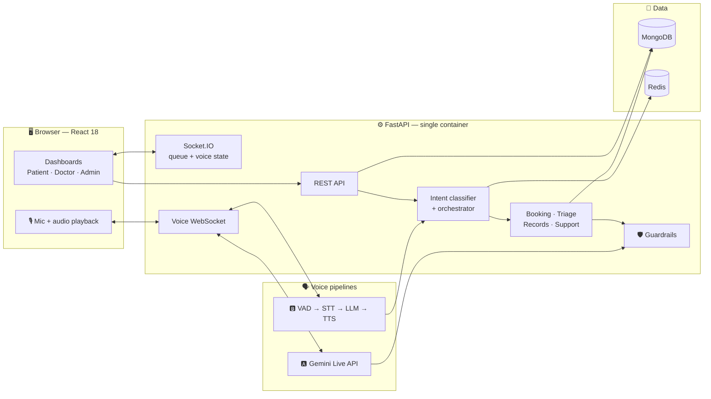
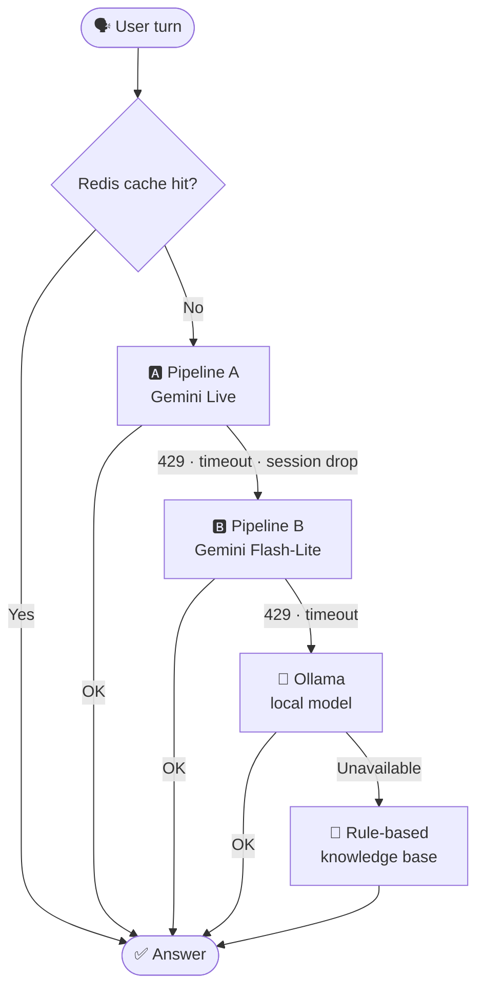

<div align="center">

# 🏥 CareFlow

### Voice-First Patient & Appointment Assistant

*Book appointments, track a live queue, and talk to **CareBot** — a multi-agent voice assistant that speaks English, Hindi and Kannada.*

<br/>


<br/>

[Features](#-features) •
[CareBot](#-carebot--the-voice-agent) •
[Architecture](#-architecture) •
[Latency](#-latency-targets) •
[Guardrails](#-healthcare-guardrails) •
[Quick Start](#-quick-start) •
[Roadmap](#-roadmap)

</div>

---

> [!WARNING]
> **Demo system — do not enter real health information.**
> CareFlow uses synthetic data only. The Gemini free tier allows Google to use submitted content to improve its products, so no real patient data or real voice recordings belong here.

> [!NOTE]
> **Project status:** milestones **M1** and **M2** are complete: login, booking, visit history, the live queue and the doctor's queue controls, running in Docker Compose with MongoDB and Redis. Patients can chat with CareBot in the app by text, in English, Hindi or Kannada, through four specialist agents. Patients can also talk to CareBot: **Start voice** in the chat window streams the microphone to the cascaded voice pipeline and plays the spoken reply. It works, but it is slow (see Benchmarks). The design below is the plan from the [PRD](PRD.md); see the [Roadmap](#-roadmap) for what exists today.

## 💡 The Problem

Outpatient departments run on front-desk phone calls and paper tokens. Patients don't know which department to visit, can't see real wait times, and call the front desk for information a system could answer.

**CareFlow** replaces that with real-time queue state, self-service booking, and a voice/text assistant for routine requests — while keeping clinical judgement strictly with doctors.

The engineering focus is the **voice agent**: two interchangeable voice pipelines, measured per-stage latency, graceful failover when free-tier quotas run out, and guardrails enforced in code.

---

## ✨ Features

<table>
<tr>
<td width="33%" valign="top">

### 🧑‍⚕️ Patient

- Book, reschedule and cancel by department or doctor
- Live queue position — *"3 patients ahead of you"*
- Doctor delay broadcasts with updated ETA
- Symptom-based department routing (**not diagnosis**)
- Visit & prescription history (last 12 months)
- Talk to CareBot by voice or text

</td>
<td width="33%" valign="top">

### 👨‍⚕️ Doctor

- Today's queue at a glance
- Mark patients `in_consultation`, `done` or `no_show`
- Broadcast a delay — pushed live to every waiting patient
- Seeded schedules

</td>
<td width="33%" valign="top">

### 📊 Admin

- Department load: queue depth, doctors on duty
- Voice latency P50 / P95 per stage, per pipeline
- Time to first audio
- Intent mix and fallback rate
- Gemini quota errors

</td>
</tr>
</table>

**Languages:** English · हिन्दी · ಕನ್ನಡ · code-mixed speech (*"kal ka appointment cancel karo"*)

---

## 🤖 CareBot — the voice agent

### Four specialist agents

Each agent is bound to a narrow tool set, so it can only do its own job.

| Agent | What it does | Hard limit |
|---|---|---|
| 📅 **Booking** | Checks availability, books, reschedules, cancels — real database tool calls | Acts only for the logged-in patient |
| 🩺 **Triage** | Maps symptoms to a department (*"chest pain" → Cardiology*) | Never diagnoses, prescribes or gives dosage |
| 📋 **Records** | Reads visit and prescription history | The authenticated patient's own records only |
| ℹ️ **Support** | Timings, department locations, emergency contact | — |

**Routing without an LLM call.** A fast local intent classifier (keywords + a small multilingual embedding model) handles most turns on CPU. Only low-confidence turns go to the LLM, which removes one model round-trip from the typical turn.

### Two voice pipelines, switchable in the UI

| | 🅰️ Pipeline A — Real-time | 🅱️ Pipeline B — Cascaded, open source |
|---|---|---|
| **Role** | Primary | Fallback + measurable baseline |
| **Flow** | Browser mic → FastAPI WebSocket → **Gemini Live API** → audio streamed back | **Silero VAD** → **faster-whisper** → intent classifier → **Gemini Flash-Lite** → sentence-chunked **TTS** |
| **Strength** | Lowest latency; speech-to-speech in one model | Every stage measurable and swappable; works when Live quota is exhausted |
| **Routing** | One Live session holds all tools, with server-side guardrail checks on every tool result | Per-turn router dispatches to specialist agents |

> **Why routing differs:** the Live API keeps a single session per conversation, so per-turn agent hand-off isn't possible there without restarting the session and losing latency. This is a deliberate trade-off.

### Shared behaviour

- 🧠 **Conversation memory** — follow-ups like *"what time was that again?"* resolve
- 🔄 **Server-driven state machine** — `LISTENING → TRANSCRIBING → THINKING → TOOL_EXECUTION → SPEAKING`, streamed over Socket.IO so the UI never guesses timing
- ✋ **Barge-in** — speaking during playback stops the bot and starts a new turn
- 🧾 **Workflow tracker** — each booking moves through `received → intent_classified → slot_checked → confirmed / failed` in Redis
- ⚡ **Response cache** — frequent questions (*"OPD timings"*) are answered from Redis with no LLM call
- 📈 **Per-turn analytics** — pipeline, intent, stage timings and fallback tier

---

## 🏗 Architecture



### Failover chain

Free-tier quotas run out. CareFlow degrades step by step instead of failing.



- **Circuit breaker** — after 3 consecutive Gemini `429`s, Gemini is skipped for 60 seconds instead of failing every request
- Every turn records which tier answered; the fallback rate appears on the analytics page
- When a Live session hits its duration limit, the client reconnects and conversation memory carries the context across

---

## ⏱ Latency targets

The headline number is **time to first audio (TTFA)**: the user stops speaking → the first audio plays.

| Metric | 🅰️ Pipeline A | 🅱️ Pipeline B |
|---|:---:|:---:|
| TTFA P50 | < 1.5 s | < 2.5 s |
| TTFA P95 | < 2.5 s | < 4.0 s |

These are **targets, not results**. They will be measured on a laptop CPU over a home connection.

<details>
<summary><b>Pipeline B latency budget — stage by stage</b></summary>

<br/>

| Stage | Measured as | Main levers |
|---|---|---|
| End-of-speech detection | Last speech frame → VAD end event | VAD silence threshold |
| STT | VAD end → final transcript | Model size, int8 quantisation, beam size |
| Routing | Transcript → agent selected | Local classifier first; LLM only on low confidence |
| LLM time-to-first-token | Request → first token | Flash-Lite, short prompts, cache hits skip this stage |
| TTS first chunk | First full sentence → first audio bytes | Sentence-level chunking, streaming while the LLM still generates |

Pipeline A is measured end to end, since its stages happen inside one model.

</details>

### 📊 Benchmarks

> 🚧 **Work in progress.** Before/after numbers for each optimisation (for example, how much answering common questions without the LLM cuts time to first audio) are added as the work is done. That before/after table is the main deliverable of the project.

#### Voice pipeline B — baseline (measured)

19 spoken English questions, streamed to the app over the voice WebSocket at speaking speed, before any optimisation. Run with `python eval/latency_bench.py`; the raw numbers are in [`backend/eval/results/baseline.json`](backend/eval/results/baseline.json).

| Stage | P50 | P95 |
|---|---:|---:|
| End-of-speech detection | 0.55 s | 0.65 s |
| Speech to text (Whisper `base`, 8 threads) | 4.12 s | 7.75 s |
| Routing | 0.01 s | 4.20 s |
| LLM, tools included (Gemini Flash-Lite) | 2.04 s | 4.00 s |
| TTS first chunk (Piper) | 0.77 s | 3.24 s |
| **Time to first audio** | **7.94 s** | **13.59 s** |

- **The targets are 2.5 s (P50) and 4.0 s (P95), so this is about three times too slow.** It is the "before" column for the optimisation work that follows.
- **Speech to text is the largest stage**, at about half the wait. Whisper `small`, the planned model, was slower still on this laptop (10 to 20 s per utterance), so `base` is used.
- **With 19 turns, P95 is the slowest turn.** The 4.2 s routing figure is the one turn the local classifier handed to the LLM; the other 18 were routed locally in about 10 ms.
- **Every reply was spoken by Piper.** Gemini TTS was out of free quota (HTTP 429) for the whole run.
- **The LLM is not steady on the free tier.** In an earlier three-turn check, plain Gemini requests took 4 to 11 s and time to first audio was 18 to 28 s.
- The questions are synthesised speech, not recorded voices, and all in English. Hardware: an 8-thread laptop CPU, with the app in Docker Desktop on Windows.

#### Optimisation 1 — give Whisper only the audio it needs (measured)

Whisper pads every utterance to 30 seconds, and its encoder's cost follows the padded length, so a 2-second question cost as much as a 30-second one. The encoder now gets the utterance plus 5 seconds of quiet, and never less than 8 seconds. Same 19 questions, same hardware; raw numbers in [`stt-short-window.json`](backend/eval/results/stt-short-window.json).

| Stage | Before P50 | After P50 | Before P95 | After P95 |
|---|---:|---:|---:|---:|
| Speech to text | 4.12 s | **1.02 s** | 7.75 s | 5.11 s |
| **Time to first audio** | 7.94 s | **4.48 s** | 13.59 s | 12.71 s |

- **Accuracy did not change on these clips**: 18 of 19 transcribed exactly, with either window.
- **The window must not be tight.** With only 1 second of quiet after the speech, Whisper looped and repeated itself (word error rate above 100%), which is why the margin is 5 seconds.
- **P95 barely moved, because it is one turn.** The first turn of each run is the slowest, in both runs; the other 18 turns took 2.6 to 8.3 s.
- **What did not help:** thread count (4, 6 or 8), dropping timestamps, fixing the language, and a single decoding temperature all left the stage at about 4 s. Whisper `tiny` was faster but less accurate; `small` took about 20 s.
- Hiss, hum and clicks that get past the voice-activity detector are now dropped by a confidence check, where Whisper used to invent a sentence for them.
- Still about twice the 2.5 s target. The LLM, at about 2 s, is now the largest stage.

#### Optimisation 2 — answer repeat hospital questions from Redis (measured)

A reply about the hospital itself (timings, a department's location, the emergency contact) is the same for every patient, so the LLM's answer is kept in Redis for an hour and reused. The benchmark was run twice: once with an empty cache, then again with the cache the first run had filled. Raw numbers: [`response-cache-cold.json`](backend/eval/results/response-cache-cold.json), [`response-cache-warm.json`](backend/eval/results/response-cache-warm.json).

| The 4 hospital questions | Cache empty | Cache hit |
|---|---:|---:|
| LLM stage | 2.1 – 2.6 s | 0.01 – 0.2 s |
| Time to first audio | 4.4 – 5.1 s | 2.4 – 3.7 s |

- **All 4 hospital questions hit the cache on the second run**, and two of them came in under the 2.5 s target.
- **The other 15 turns do not benefit**, and the overall median did not improve: it was 4.72 s on the first run and 5.40 s on the second, because the LLM happened to be slower during the second (2.86 s against 2.12 s at P50). Free-tier latency varies by more than this optimisation saves across a mixed set of questions.
- **By text, a repeated question took 5.7 s the first time and 0.03 s the second.**
- **Never cached:** anything about a patient (records, bookings, symptoms), and questions that lean on the conversation ("Where is it?"). Keys are hashes, so a patient's wording is not stored.
- A first-time question still pays for the LLM. The cache only helps what has been asked before, in the same words and language.

#### Intent classifier (measured)

How often the local classifier picks the right agent, and how often it is sure enough to skip the LLM. Run with `python eval/run_eval.py --classifier --set all`.

| Set | Stages | Best guess correct | Settled without the LLM | Wrong when confident |
|---|---|:---:|:---:|:---:|
| Dev (75) | Keywords only | 75 / 75 | 72 / 75 | 0 |
| Dev (75) | Keywords + embeddings | 75 / 75 | 73 / 75 | 0 |
| Held-out (34) | Keywords only | 12 / 34 (35%) | 9 / 34 (26%) | 0 |
| Held-out (34) | Keywords + embeddings | 29 / 34 (85%) | 16 / 34 (47%) | 0 |

- **The dev score is not a quality claim.** That set was written together with the keyword rules, so it only guards against regressions. The held-out set was written before the rules were first run, and is the honest number.
- **Keywords alone do not generalise**: on unseen phrasings they recognise about a third. The embedding stage is what lifts the best guess to 85%.
- **Kannada is the weak spot**: 5 / 7 held-out with embeddings, against 7 / 7 for Hindi. The embedding model (`paraphrase-multilingual-MiniLM-L12-v2`) was not trained on Kannada.
- **About half of unseen turns still go to the LLM.** The thresholds are cautious: no confident local answer was wrong on either set, at the cost of handing off more often.
- Both sets are small and were written by the project author, not collected from patients.

| Script | What it measures |
|---|---|
| `eval/run_eval.py --classifier` | Intent accuracy of the local classifier on labelled utterances (EN / HI / KN / code-mixed) — results above |
| `eval/run_eval.py --live` | End-to-end tool-call correctness with the real LLM |
| `eval/stt_wer.py` | faster-whisper word error rate at 16 kHz vs 8 kHz phone-grade audio, per language |
| `eval/latency_bench.py` | P50 / P95 per stage for the voice pipeline — baseline above |
| `loadtest/locustfile.py` | P95 response time for 20–50 concurrent text sessions |

---

## 🛡 Healthcare guardrails

Guardrails are enforced **in code, not only in prompts**, and each one has a test. Guardrail tests run as their own required CI job.

| Rule | How it is enforced |
|---|---|
| 🩺 Triage never diagnoses, prescribes or gives dosage | System prompt **plus** a pattern-based output filter that replaces violations with a safe fallback — also applied to Live API tool results and transcripts |
| ⚠️ Every triage response shows a disclaimer | Added server-side and rendered by a dedicated UI component |
| 🪪 Identity comes from the session, never the model | Every tool receives the user ID and role from the verified JWT; tools accept no patient ID from the LLM |
| 🚫 No privileged self-registration | The register endpoint creates patients only; doctors and admins are seeded |
| 🔌 Sockets require auth | JWT checked on connect; patients receive only their own queue position |
| 📅 No double booking | Unique index on `(doctor_id, slot_start)`; a duplicate insert returns `409` |
| ✋ No change without a confirming turn | Booking, cancelling and rescheduling tools only take effect in the turn after the one that proposed them, so the patient always hears the change first |
| 🗃️ Only public answers are cached | The Redis response cache holds replies about the hospital only; a reply to a records, booking or symptom question is never stored or shared |
| 🚦 Abuse and quota protection | Rate limits on auth, chat and voice endpoints |
| 🧪 Mock DB never used outside tests | The app refuses to start with the mock database unless running in the test environment |

**Data handling:** raw audio is processed in memory and never stored. Analytics store timings and intent labels, not transcripts.

---

## 🛠 Tech stack

Every component is free-tier or open source.

| Layer | Technology |
|---|---|
| **Frontend** | React 18 · Vite · React Router 6 · Socket.io-client · Axios |
| **Backend** | Python 3.12 · FastAPI · Uvicorn · python-socketio |
| **Database** | MongoDB (Motor + Beanie) — Atlas free tier for the demo |
| **Cache / workflow** | Redis — Upstash free tier for the demo |
| **Auth** | PyJWT · bcrypt |
| **LLM** | Gemini Flash / Flash-Lite · Ollama (offline fallback) |
| **Real-time voice** | Gemini Live API (native audio) |
| **Intent classifier** | Keyword rules + a multilingual sentence-transformers model run through fastembed (ONNX, local CPU) |
| **VAD / STT / TTS** | Silero VAD · faster-whisper · Gemini Flash TTS · Piper (local, English; GPL-3.0, optional) |
| **Observability** | structlog · Langfuse (optional, self-hosted) |
| **Testing** | pytest · httpx · Vitest · React Testing Library · Locust |
| **Quality** | ruff · mypy · ESLint · Prettier · pre-commit · gitleaks |
| **DevOps** | Docker Compose · GitHub Actions · Dependabot |

---

## 🚀 Quick start

### Try it now — no Docker or database needed

This runs the whole app against an in-memory database that is already seeded. Everything is lost when you stop it.

```bash
git clone https://github.com/RahulBailur/CareFlow.git
cd CareFlow

cd frontend && npm ci && npm run build && cd ..

cd backend
python -m venv .venv
.venv\Scripts\activate          # macOS / Linux: source .venv/bin/activate
pip install -e ".[dev]"
python scripts/dev_server.py
```

Then open **http://localhost:8000**. The server prints a patient, a doctor and an admin login when it starts.

To see the live queue, open the patient in one browser window and the doctor in another, then start a consultation or broadcast a delay from the doctor's side.

### With Docker Compose

This runs the app with a real MongoDB and Redis. Data is kept in a Docker volume between restarts.

```bash
cp .env.example .env            # then set JWT_SECRET and SEED_DEFAULT_PASSWORD in .env
docker compose up --build -d    # app :8000 · mongo :27017 · redis :6379
docker compose exec app python scripts/seed_data.py
```

Then open **http://localhost:8000** and log in with a seeded account (for example `ananya@careflow.example`) and the password you set as `SEED_DEFAULT_PASSWORD`.

`docker compose down` stops everything; add `-v` to also delete the data.

<details>
<summary><b>Optional — fully offline LLM fallback</b></summary>

<br/>

```bash
docker compose --profile offline up -d ollama
docker compose exec ollama ollama pull <small-instruct-model>
```

</details>

<details>
<summary><b>Key environment variables</b></summary>

<br/>

| Variable | Purpose | Example |
|---|---|---|
| `LLM_PROVIDER` | Which LLM backend to use. `mock` means no model: CareBot answers from rules only | `gemini` · `mock` |
| `GEMINI_API_KEY` | Free key from Google AI Studio | — |
| `VOICE_PIPELINE_DEFAULT` | Pipeline used on first load | `live` · `cascade` |
| `STT_PROVIDER` / `TTS_PROVIDER` / `VAD_PROVIDER` | Which speech components to use; the mock ones need no model | `faster_whisper` / `gemini` / `silero` |
| `WHISPER_MODEL` | faster-whisper model size | `small` · `base` |
| `VAD_SILENCE_MS` | Silence before end-of-speech | `500` |
| `GEMINI_BREAKER_THRESHOLD` | Consecutive `429`s before the breaker opens | `3` |
| `GEMINI_BREAKER_COOLDOWN_S` | Seconds Gemini is skipped | `60` |

Model IDs live only in `.env`, never in code — free-tier model names change.

</details>

---

## 👥 Roles

| Role | How created | Can do |
|---|---|---|
| 🧑‍⚕️ **Patient** | Self-registration | Book / reschedule / cancel, live queue, CareBot, own history |
| 👨‍⚕️ **Doctor** | Seeded only | Queue controls, delay broadcast |
| 📊 **Admin** | Seeded only | Department load, latency & analytics page |

<details>
<summary><b>🌐 API endpoints</b></summary>

<br/>

| Method | Endpoint | Auth | Description |
|---|---|---|---|
| `POST` | `/api/auth/register` | — | Register a patient |
| `POST` | `/api/auth/login` | — | Login (all roles) |
| `GET` | `/api/auth/me` | JWT | The logged-in user |
| `GET` | `/api/appointments/availability` | JWT | Open slots by department / doctor / date |
| `POST` | `/api/appointments/book` | Patient | Book a slot (`409` if taken) |
| `PUT` | `/api/appointments/{id}` | Owner | Reschedule / cancel |
| `GET` | `/api/appointments/me` | Patient | Own visit & prescription history |
| `GET` | `/api/appointments/queue/{doctor_id}` | JWT | Queue status |
| `PUT` | `/api/appointments/{id}/status` | Doctor | Update consultation status |
| `GET` | `/api/doctors/{doctor_id}/schedule` | JWT | View schedule |
| `POST` | `/api/doctors/status` | Doctor | Broadcast delay / availability |
| `GET` | `/api/admin/stats` | Admin | Department load |
| `GET` | `/api/admin/analytics` | Admin | Latency, intent mix, fallback rate |
| `GET` | `/api/hospital/config` | — | Public hospital info |
| `POST` | `/api/chat` | JWT | CareBot text turn (rate-limited) |
| `WS` | `/ws/voice?pipeline=live\|cascade` | JWT | CareBot voice stream |

</details>

---

## 🗺 Roadmap

| | Milestone | Scope | Tag |
|:---:|---|---|:---:|
| ✅ | **M1 — Foundation** | Repo, Docker Compose, CI, pre-commit, models, auth, seed data, demo banner | `v0.1.0` |
| ✅ | **M2 — Appointments & real-time** | Availability, unique-slot booking, history, authenticated Socket.IO queue, delay broadcast, patient and doctor screens | `v0.2.0` |
| ✅ | **M3 — Agents & Pipeline B** | Intent classifier, guardrails + tests, eval set, specialist agents, text chat in the app, cascaded voice pipeline with barge-in, voice in the app ✅ | `v0.3.0` |
| ⬜ | **M4 — Pipeline A & reliability** | Gemini Live pipeline, failover chain + circuit breaker, latency bench, 8 kHz WER test, load test | `v0.4.0` |
| ⬜ | **M5 — Analytics & demo** | Analytics page, demo deployment, benchmarks, demo GIF, "hardest problem" write-up | `v0.5.0` |

<details>
<summary><b>🔭 Out of POC scope</b></summary>

<br/>

- Telephony channel (Twilio / Exotel) with outbound reminder calls
- Real-time Indic TTS on GPU and Indic-specific STT models
- Multiple Uvicorn workers with the Socket.IO Redis manager
- Refresh tokens, audit log of records access, appointment reminders
- Doctor schedule editing, complaints, password reset
- Compliance work (DPDP Act, HIPAA-style controls) and a paid LLM tier

</details>

---

<div align="center">

**CareFlow is a proof of concept, not a medical device.**
It does not diagnose, prescribe or replace a doctor.

📄 Full specification: [PRD.md](PRD.md)

Built by [Rahul Bailur](https://github.com/RahulBailur)

</div>
